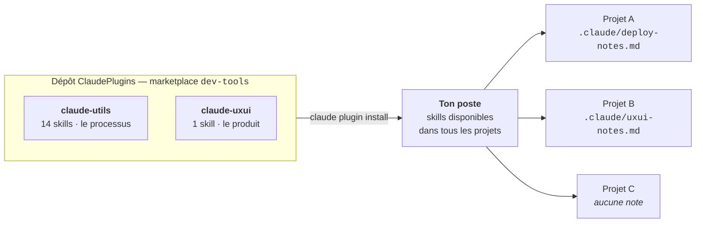

# ClaudePlugins

[](https://github.com/vynarim/ClaudePlugins/actions/workflows/garde-fou.yml)
[](#les-deux-plugins)
[](LICENSE)

**Des skills Claude Code qui portent une méthode** — auditer, tester, publier, documenter, mettre en
page — **et lisent les spécificités de chaque dépôt dans un fichier de notes.** Une leçon apprise
dans un projet profite à tous les autres, sans recopier la procédure nulle part.

Marketplace `dev-tools`, deux plugins, 15 skills. Repo public, aucune authentification requise.



La skill porte **la méthode**, le projet déclare **ses spécificités**. C'est ce qui permet à `/deploy`
de servir un dépôt qu'elle n'a jamais vu — et de s'arrêter plutôt que d'inventer une commande quand
le dépôt n'a rien déclaré.

## Installer

```powershell
claude plugin marketplace add vynarim/ClaudePlugins
claude plugin install claude-utils@dev-tools
claude plugin install claude-uxui@dev-tools   # seulement si le poste travaille sur des interfaces
```

Puis recharger la fenêtre VS Code (*Developer: Reload Window*) — les plugins sont chargés à
l'ouverture. Détails, vérification et dépannage : [INSTALL.md](INSTALL.md).

> [!IMPORTANT]
> Scope `user` **ou** scope `project`, pas les deux. Si tu as lancé les commandes ci-dessus (scope
> poste), déclarer en plus le plugin dans le `.claude/settings.json` d'un projet crée une seconde
> installation et le fait apparaître **en double** dans `/plugin`. Le gabarit
> [`examples/project.claude-settings.json`](examples/project.claude-settings.json) sert aux dépôts
> partagés, où il propose l'install à ceux qui ne l'ont pas — voir
> [DEPLOYMENT.md](DEPLOYMENT.md#activer-des-plugins-dans-un-projet).

> [!NOTE]
> Les plugins de ce repo **n'exécutent aucun code** : ni hook, ni serveur MCP, ni variable
> d'environnement. Ils n'apportent que des skills.

## Les deux plugins

Deux axes distincts, installables séparément. Un dépôt sans interface n'a aucune raison d'installer
le second.

| Plugin | Version | Axe | Question à laquelle il répond |
|---|---|---|---|
| [`claude-utils`](claude-utils/) | 2.8.1 | le **processus** de développement | « comment je travaille sur ce dépôt ? » |
| [`claude-uxui`](claude-uxui/) | 0.1.0 | le **produit** affiché à l'utilisateur | « à quoi ressemble l'application ? » |

> [!NOTE]
> `metadata.version` de la marketplace est la version du **catalogue**, pas celle d'un plugin. Chaque
> plugin porte la sienne, dans son `plugin.json` et dans la colonne ci-dessus.

### `claude-utils` — 14 skills

| Famille | Skills | Ce que ça règle |
|---|---|---|
| Contexte & session | `eco` · `context-check` · `session-brief` · `handoff` | Rester sous les limites, savoir où on en est, laisser une trace relue au démarrage suivant |
| Revue & non-régression | `audit` · `test` · `ci` | Revue par axes avec journal à ids stables, batterie locale, et son pendant distant à la poussée |
| Livraison | `ship` · `deploy` · `pr-draft` | Commit/push, mise en production cible par cible, description de PR |
| Documentation | `doc` | Réaligner le README sur le dépôt — axe fond et axe forme |
| Cohérence & maintenance | `kit-sync` · `perms` · `update-plugins` | Aligner deux projets frères, nettoyer les permissions, appliquer les nouvelles versions |

<details>
<summary><b>Le détail des 14 skills</b></summary>

| Skill | Invocation | Rôle |
|---|---|---|
| `eco` | `/eco` | Discipline tokens/contexte — une session = un objectif, `/clear` aux bascules, délégation aux sous-agents |
| `audit` | `/audit` | Revue de code par axes (sécurité, données, métier, perf, propreté, config) : demande l'axe, classe par gravité, déclare sa couverture et tient un journal ; `/audit regression` rejoue les correctifs passés |
| `test` | `/test` | Batterie de non-régression : tableau ✅/❌ par étape, et ce que la batterie n'a **pas** éprouvé. Ne committe rien, ne touche jamais la prod |
| `ci` | `/ci` | Garde-fou distant, pendant de `/test` : un workflow GitHub Actions qui rejoue la batterie à la poussée. N'écrit une étape que si son script existe réellement |
| `doc` | `/doc` | Réaligne le README sur le dépôt, en deux axes : **fond** (écarts classés `périmé` / `absent` / `inventé`) et **forme** (`/doc forme` : ordre de lecture, aération, mermaid, encarts) |
| `context-check` | `/context-check` | Audite le `CLAUDE.md` du projet et propose la version condensée |
| `kit-sync` | `/kit-sync` | Compare un socle partagé entre projets frères : divergence classée progrès / adaptation légitime / dérive, propagation proposée jamais appliquée en silence |
| `perms` | `/perms` | Ménage des listes de permissions : entrées ombrées par un motif plus large, entrées périmées, gestes destructeurs en `allow` proposés en `ask` — jamais en `deny` |
| `ship` | `/ship` | Commit + push : découpe en commits cohérents, message aligné sur l'historique ; bumpe la version si les notes du projet le demandent |
| `deploy` | `/deploy` | Mise en production : bump, vérifications, envoi via `ship`, déploiement cible par cible, vérification en ligne |
| `pr-draft` | `/pr-draft` | Génère titre + corps structuré de PR GitHub depuis le diff courant |
| `session-brief` | `/session-brief` | Brief de reprise : git status, PRs ouvertes, mémoire projet |
| `handoff` | `/handoff` | Trace d'état de fin de session — état courant, trois points de reprise, dettes et fausses pistes — écrite dans le fichier que le projet utilise déjà |
| `update-plugins` | `/update-plugins` | Met à jour les plugins dev-tools sur le poste (`claude plugin update`) |

Méthode complète et mécanique des notes : [claude-utils/README.md](claude-utils/README.md) ·
Prise en main depuis un poste neuf : [claude-utils/QUICKSTART.md](claude-utils/QUICKSTART.md).

</details>

### `claude-uxui` — 1 skill

| Skill | Invocation | Rôle |
|---|---|---|
| `ui-frame` | `/ui-frame` | Affiche une application mobile-only dans un cadre téléphone centré sur écran large — ratio conservé, **rien de changé sous le seuil**. Traite les cinq échappées qui font rater un cadre posé à la main : scroll sur le mauvais conteneur, `position: fixed` qui dérive, portail hors cadre, `vh` calculé contre la vraie fenêtre, breakpoint JS qui lit la largeur de l'écran |

> [!WARNING]
> Une consigne de mise en page appliquée au mauvais projet ne dégrade pas le résultat : elle casse la
> page. Chaque skill de ce plugin établit d'abord le **profil** du dépôt (`mobile-only` ·
> `mobile-first` · `responsive` · `desktop`) et **s'arrête** s'il ne correspond pas, au lieu de
> basculer en mode dégradé.

Détails : [claude-uxui/README.md](claude-uxui/README.md).

## Les notes projet

Le mécanisme central du catalogue. Une skill ne devine jamais les spécificités d'un dépôt : elle les
lit dans `.claude/<nom>-notes.md`, versionné avec le projet.

| Skill | Fichier | Sans lui |
|---|---|---|
| `deploy` | `.claude/deploy-notes.md` | **la skill s'arrête** — une commande de déploiement inventée ne se rattrape pas |
| `audit` | `.claude/audit-notes.md` | tourne quand même, elle connaît juste moins le terrain |
| `test` | `.claude/test-notes.md` | tourne quand même, en déduisant les étapes de `package.json` |
| `doc` | `.claude/doc-notes.md` | tourne quand même, en reconstituant la carte à chaque passage |
| `kit-sync` | `.claude/kit-notes.md` | demande une fois le projet frère et le chemin du socle, puis tourne |
| `perms` | `.claude/perms-notes.md` | re-propose à chaque passage les entrées qu'on a décidé de garder |
| `ui-frame` | `.claude/uxui-notes.md` | détecte le profil et demande confirmation à chaque passage |

`ci` **n'a pas** de notes propres, et c'est voulu : elle lit celles de `test` et de `deploy`. Une
skill qui réclame ses propres notes pour redire ce qui est écrit à côté fabrique la divergence.

Deux skills tiennent en plus un **journal**, écrit sans demander parce que c'est un fichier
d'arbitrage et non du code : `.claude/audit-log.md` et `.claude/kit-log.md`.

## Documentation

| Document | Pour quoi |
|---|---|
| [**Tutoriel HTML**](https://vynarim.github.io/ClaudePlugins/) | Prise en main Claude Code + VS Code en ~30 min : d'un site à une PWA, déploiement Firebase, et consommation de tokens |
| [INSTALL.md](INSTALL.md) | Installer, vérifier, mettre à jour, dépanner |
| [DEPLOYMENT.md](DEPLOYMENT.md) | Ajouter un plugin ou une skill, publier une version, activer dans un projet |
| [claude-utils/README.md](claude-utils/README.md) · [claude-uxui/README.md](claude-uxui/README.md) | Le détail de chaque plugin |

<details>
<summary><b>Structure du repo</b></summary>

| Chemin | Rôle |
|---|---|
| `.claude-plugin/marketplace.json` | Catalogue `dev-tools` — déclare les plugins publiés |
| `<plugin>/.claude-plugin/plugin.json` | Manifeste d'un plugin (`version` à bumper pour publier) |
| `<plugin>/skills/<nom>/SKILL.md` | Une skill (dossier `skills/` auto-découvert) |
| `<plugin>/skills/<nom>/references/` | Annexes d'une skill : gabarits de notes projet, checklists d'axes |
| `examples/` | Gabarit de `.claude/settings.json` à copier dans un projet |
| `docs/` | Source du tutoriel publié sur GitHub Pages |
| `.claude/skills/` | Skills **internes** au repo (`skill-new`, `plugin-check`), jamais publiées |
| `.github/workflows/garde-fou.yml` | Rejoue à la poussée les contrôles de cohérence du catalogue |

</details>

## Mettre à jour

```powershell
claude plugin marketplace update dev-tools   # rafraîchit le catalogue
claude plugin update claude-utils@dev-tools  # applique la nouvelle version
```

Avec `claude-utils` installé, `/update-plugins` enchaîne les deux.

> [!WARNING]
> `marketplace update` **ne suffit pas** : il rafraîchit le catalogue, pas les plugins installés.
> C'est `claude plugin update` qui applique le bump. Un plugin **nouveau** demande un `install`, que
> `update` ne fera jamais à ta place.

Pour que les versions arrivent seules, ajouter `"autoUpdate": true` à l'entrée `dev-tools` de
`~/.claude/settings.json` — l'option n'est pas exposée par le CLI, voir
[INSTALL.md](INSTALL.md#automatiser--loption-autoupdate).

---

MIT — voir [LICENSE](LICENSE).
